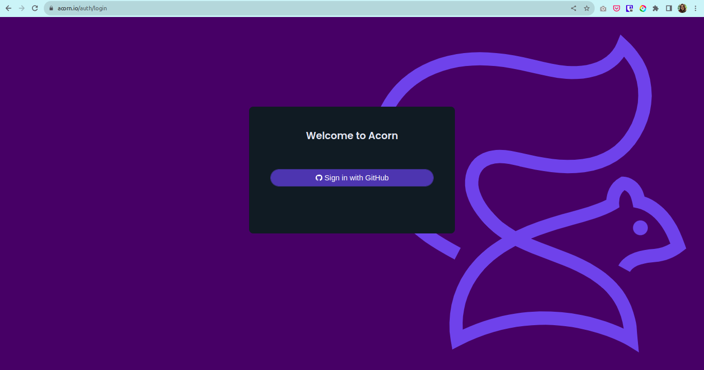
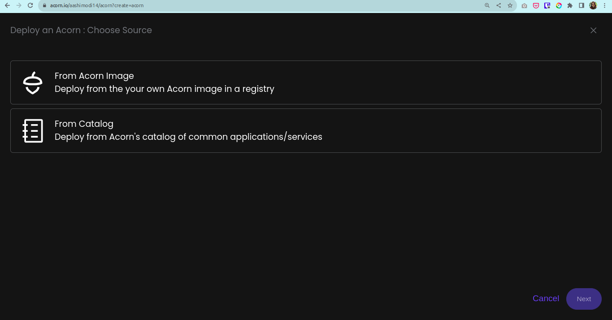
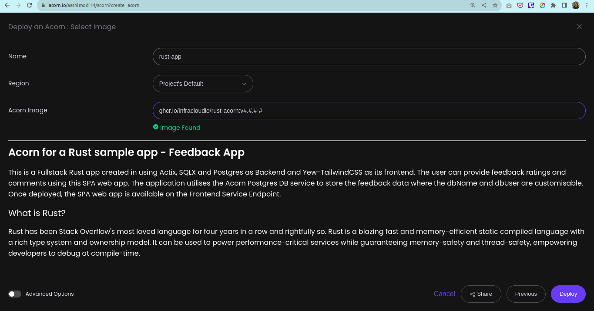
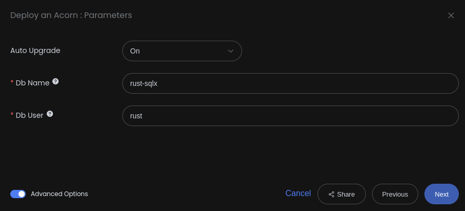
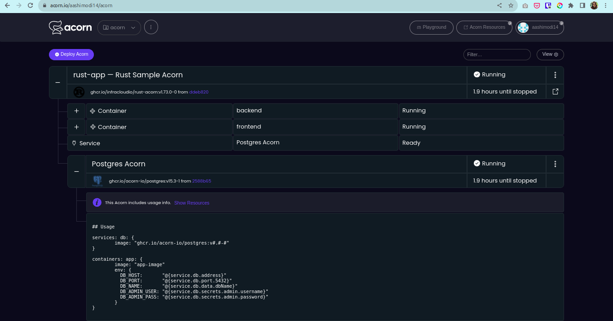
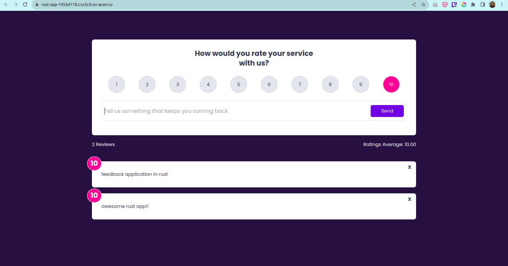
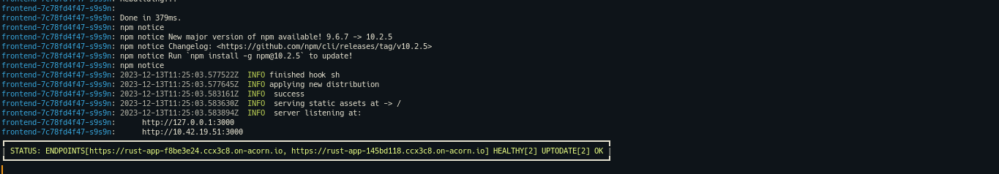

# Deploying Rust Feedback App on Acorn

For four consecutive years, Rust has secured the coveted title of the most beloved language in Stack Overflow surveys. Renowned for its lightning-fast performance, exceptional efficiency, and memory optimization, Rust places a strong emphasis on type security and collaborative development. These attributes contribute to its broad acceptance as a compelling alternative to traditional systems programming languages like C and C++. Rust enthusiasts appreciate its adept problem-solving capabilities, which address challenges encountered in various other languages while maintaining a minimal set of drawbacks.

Unlock the potential of your applications with the dynamic combination of Rust and Containers – a formula that propels your apps into high-performance mode, fortified, agile, and prepared for any challenge! Step into the era of Cloud-Native tools, the often-overlooked heroes reshaping the landscape of app development, deployment, and scalability. Yet, navigating Cloud-Native tools like Kubernetes introduces complexities in managing infrastructure and ensuring security. Introducing the Acorn Cloud Platform – your gateway to seamless, scalable, and secure cloud operations. Acorn streamlines intricate workflows, expedites development, and guarantees reliability through an intuitive interface and cutting-edge features. Deploying on Acorn is a breeze – simply define your application with an [Acornfile](https://docs.acorn.io/reference/acornfile) to generate a deployable Acorn Image. Welcome to a new era of elevated application performance and simplified cloud operations!

Below we delve into the deployment process of an exemplary Rust Feedback application on the Acorn Cloud Platform. This Fullstack Rust application is crafted with Actix, SQLX, and Postgres serving as the backend, while Yew-TailwindCSS takes charge of the frontend. The application utilizes a database service for feedback data storage, enabling users to effortlessly submit ratings and comments through this single-page web app (SPA). Join us on this journey as we uncover the seamless integration of Rust and the Acorn Cloud Platform for a refined feedback experience. 

If you want to skip to the end, just click below button (Click on `Customize before deploying` to update default arguments such as DBName and DBUser) to launch the app immediately in a free sandbox environment. All you need is a GitHub ID to create an account.

[](https://acorn.io/run/ghcr.io/infracloudio/rust-acorn:v1.73.0-0?ref=aashimodi14&name=feedback-app)

> _Note: Everything shown in this tutorial can be found in [this repository](https://github.com/infracloudio/rust-acorn)_.
## Pre-requisites

- Acorn CLI: The CLI allows you to interact with the Acorn Runtime as well as Acorn to deploy and manage your applications. Refer to the [Installation documentation](https://docs.acorn.io/installation/installing) to install Acorn CLI for your environment.
- A GitHub account is required to sign up and use the Acorn Platform.

## Acorn Login

Log in to the [Acorn Platform](http://acorn.io) using the GitHub Sign-In option with your GitHub user.



After the installation of Acorn CLI for your OS, you can login to the Acorn platform.

```sh
$ acorn login
```

## Deploying the Rust Feedback App

There are two ways to deploy Rust Feedback App on Acorn Platform.

1. Using Acorn platform dashboard.
2. Using CLI

The Acorn Dashboard way is the easiest one where, in just a few clicks you can deploy the Rust Feedback app on the platform and start using it. However, if you want to customize the application use the CLI option.

## Deploying Using Acorn Dashboard

In this option you use the published Acorn application image to deploy the Rust Feedback App in just a few clicks. It allows you to deploy your applications faster without any additional configurations. Let us see below how you can deploy Rust Feedback App to the Acorn platform dashboard.

1. Login to the [Acorn Platform](https://acorn.io/auth/login) using the Github Sign-In option with your Github user.
2. Select the "Deploy Acorn" option.
3. Choose the source for deploying your Acorns
   3.1. Select “From Acorn Image” to deploy the sample Application.

   

   3.2. Provide a name "rust-app”, use the default Region and provide the URL for the Acorn image and you need to select "Advanced Options" and provide all the details required for Rust App like DBName, DBUser.

   ```sh
   ghcr.io/infracloudio/rust-acorn:v#.#.#-#
   ```

   
   


> _Note: The App will be deployed in the Acorn Sandbox Environment. As the App is provisioned on AcornPlatform in the sandbox environment it will only be available for 2 hrs and after that it will be shutdown. Upgrade to a pro account to keep it running longer_.
4. Once the Acorn is running, you can access it by clicking the `Endpoint` or the redirect link.

   4.1. Running Application on Acorn

   

   4.2. Running Rust Feedback App

   

## Deploying Using Acorn CLI

As mentioned previously, running the Acorn application using CLI lets you understand the Acornfile. With the CLI option, you can customize the Rust Feedback app to your requirement or use your Acorn knowledge to run your own Rust Feedback App.

To run the application using CLI you first need to clone the source code repository on your machine.

```sh
$ git clone https://github.com/infracloudio/rust-acorn.git
```

Once cloned here’s how the directory structure will look.

```sh
.
├── Acornfile
├── Dockerfile.backend
├── Dockerfile.frontend
├── fullstack-rust-app
├── LICENSE
├── README.md
├── rust_icon.png
```

### Understanding the Acornfile

To run the application we need an Acornfile which describes the whole application without all of the boilerplate of Kubernetes YAML files. The Acorn CLI is used to build, deploy, and operate Acorn on the Acorn cloud platform. 

Below is the Acornfile for deploying the Rust Feedback App that we created earlier:

```sh
name:        "Rust Sample Acorn"
description: "Acorn running a sample Rust app"
readme:      "./README.md"
icon:        "./rust_icon.png"


args: {
  // Name of the database to create. Defaults to "rust-sqlx"
  dbName: "rust-sqlx"
  // Name of the database user to create. Defaults to "rust"
  dbUser: "rust"
}

services: db: {
    image: "ghcr.io/acorn-io/postgres:v15.#-#"
    serviceArgs: {
        dbName: args.dbName
        dbUser: args.dbUser
    }
}

containers: {
  backend: {
    image: "ghcr.io/infracloudio/rust-backend:v2"
    env: {
    "POSTGRES_HOST": "@{service.db.address}"
    "POSTGRES_PORT": "@{service.db.port.5432}"
    "POSTGRES_USER": "@{service.db.secrets.admin.username}"
    "POSTGRES_PASSWORD":"@{service.db.secrets.admin.password}"
    "POSTGRES_DB":"@{service.db.data.dbName}"
    "DATABASE_URL":"postgresql://@{service.db.secrets.admin.username}:@{service.db.secrets.admin.password}@@{service.db.address}:5432/@{service.db.data.dbName}?schema=public"
    "PGADMIN_DEFAULT_EMAIL":"admin@admin.com"
    "PGADMIN_DEFAULT_PASSWORD":"password123"
    }
    ports: {
      publish: "8000:8000/http"
    }
    memory: 1048Mi
    consumes: ["db"]
  }
  frontend: {
    image: "ghcr.io/infracloudio/rust-frontend:v1"
    cmd: ["/bin/sh", "-c", "cd /usr/src/fullstack-rust-app/frontend && BACKEND_SERVER=$BACKEND_SERVER trunk serve --address 0.0.0.0 --port 3000"]
    ports: {
        publish: "3000:3000/http"
    }
    env: {
      // Frontend forwards the requests to the Backend Container Service Endpoint
      "BACKEND_SERVER": "@{services.backend.endpoint}"
    }
    memory: 1048Mi
    dependsOn: ["backend"]
  }
}

```

There are different components for running Rust Feedback App

- db
- backend
- frontend

The above Acornfile has the following elements:

- **Args**: Which is used to take the user args like Database Name and User for Postgres.
- **Services**: Here we're using the [Postgres](https://github.com/acorn-io/postgres) service that is deployed alongside the application into Acorn as an [Acorn Service](https://docs.acorn.io/reference/services).
- **Containers**: We define different containers with following configurations:
  - **backend**:
    - **image**: Feedback App backend Image
    - **env**: In the env section we are providing all the env variables which the application will be using.
    - **ports**: port where our backend application is listening on.
    - **consumes**: Web consumes Postgres DB
  - **frontend**:
    - **image**: Feedback App frontend Image
    - **ports**: Port where our streaming application is listening on.
    - **env**: The Backend Server Endpoint to which Frontend forwards the requests.
    - **dependsOn**: Frontend becomes available after Backend is running successfully.

### Running the Application

Once you've logged using Acorn CLI you can directly deploy applications on the Acorn platform Sandbox plan. Run the following command from the root of the directory. It runs the application with default arguments values

```sh
$ acorn run -n rust-app .
```

If you want to update the arguments, such as dbName and dbUser run the below command

```sh
$ acorn run -n rust-app . --dbName <> --dbUser <>
```

Below is what the output looks like.



## Rust Feedback App

The Rust Feedback Application is ready to be used as a fully-functional standalone application to retrieve, save and view feedbacks.


## What's Next?

1. The Rust Feedback Application provisioned on Acorn Platform is available for two hours, you should upgrade to Pro account to keep it running for longer duration.
2. After deploying you can edit the Acorn Application or remove it if no longer needed. Click the `Edit` option to edit your Acorn's Image. Toggle the `Advanced Options` switch for additional edit options.
3. Remove the Acorn by selecting the `Remove` option from your Acorn dashboard.

## Conclusion

In this tutorial we learned how to use the Acornfile and run Rust Feedback App. Also, different ways to deploy Rust Feedback App using CLI and Dashboard approach.

The Rust Feedback Application ready for use! 
